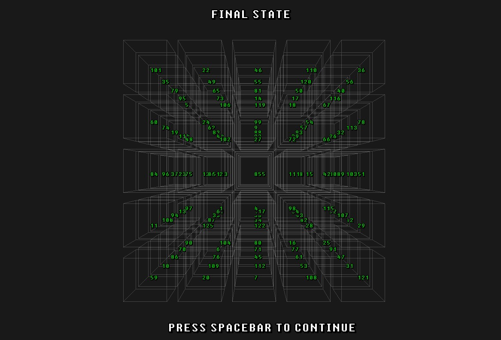

# Tugas Besar 1 IF3070 Dasar Inteligensi Artifisial : Pencarian Solusi Diagonal Magic Cube dengan Local Search
Tugas ini bertujuan untuk mengimplementasikan search algorithm, yaitu Steepest Ascent Hill Climbing, Hill Climbing with Sideways Move, Stochastic Hill Climbing, Random Restart Hill Climbing, Simulated Annealing, dan Genetic Algorithm dalam memecahkan permasalahan magic cube 5x5x5.

Anggota Kelompok :
1. Taufiq Ramadhan Ahmad (18222060)
2. Muhammad Kevinza Faiz (18222072)
3. Viktor Arsindiantoro S (18222083)
4. Timotius Vivaldi Gunawan (18222091)

---

## Table of Contents

- [About the Project](#about-the-project)
- [Getting Started](#getting-started)
  - [Prerequisites](#prerequisites)
  - [Installation and Run](#installation)
- [File Structure](#file-structure)
- [PembagianTugas](#pembagiantugas)

---

## About the Project

Tugas **Pencarian Solusi Diagonal Magic Cube dengan Local Search** bertujuan untuk menyelesaikan masalah magic cube 5x5x5 di mana jumlah bilangan pada setiap baris, kolom, tiang, diagonal ruang, dan diagonal pada suatu potongan bidang kubus bernilai sama yang disebut dengan magic number. Implementasi ini mencakup beberapa varian **hill climbing**, **simulated annealing**, dan **genetic algorithm** untuk menjelajah ruang solusi yang mungkin:
- **Steepest Ascent Hill Climbing**: Hanya memilih neighbor dengan nilai error lebih kecil.
- **Stochastic Hill Climbing**: Memilih neighbor secara acak dan menerimanya jika error neighbor lebih kecil.
- **Hill Climbing with Sideways Moves**: Memungkinkan dilakukan pemindahan ke neighbor dengan eror yang sama dengan kondisi current.
- **Simulated Annealing**: Menggabungkan eksplorasi ruang pencarian solusi dengan mekanisme probabilistik yang memungkinkan penerimaan solusi yang lebih buruk pada tahap awal pencarian untuk menghindari keterjebakan pada local minimal.
- **Genetic Algorithm**: Menerapkan konsep seleksi alam dan evolusi genetik, yaitu selection, crossover, dan mutation.

Contoh Magic Cube 5x5x5
<p align="center">
  
</p>


Repository ini terbagi menjadi 2 branch : 
1. Master branch berisi program dengan visualisasi objective function terhadap tiap iterasi
2. Branch without-plot berisi program tanpa visualisasi objective function

---

## Getting Started

### Prerequisites

- Standard **g++ compiler library**
- **Python** versi 3.12 dengan library matplotlib **(Optional : hanya untuk master branch)**.
  Jika Python atau library tidak ditemukan maka program akan exit, pastikan sudah ada
  
### Installation and Run Program

#### master branch
1. **Clone Repository**
   ```bash
   git clone https://github.com/tvaldig/Tugas-Besar1-DAI.git
   cd Tugas-Besar1-DAI
   
2. **Run the program**
   ```bash
   ./cube

#### branch without-plot
1. **Clone Repository**
   ```bash
   git clone https://github.com/tvaldig/Tugas-Besar1-DAI.git
   cd Tugas-Besar1-DAI
   git switch origin/without-plot --detach
   
2. **Run the program**
   ```bash
   ./cube

---

## File Structure
    D:.
    ├───.vscode
    ├───build
    │   ├───.cmake
    │   │   └───api
    │   │       └───v1
    │   │           ├───query
    │   │           │   └───client-vscode
    │   │           └───reply
    │   └───CMakeFiles
    │       ├───3.20.21032501-MSVC_2
    │       │   ├───CompilerIdC
    │       │   └───CompilerIdCXX
    │       └───3.31.0-rc2
    │           ├───CompilerIdC
    │           └───CompilerIdCXX
    ├───include
    │   ├───glad
    │   ├───GLFW
    │   ├───glm
    │   │   ├───detail
    │   │   ├───ext
    │   │   ├───gtc
    │   │   ├───gtx
    │   │   └───simd
    │   └───KHR
    ├───lib
    └───src
        ├───genetic
        ├───objfunc
        ├───random_restart
        ├───sideway_move
        ├───simulated_annealing
        ├───steepest_ascent_hl
        └───stochastic_hc

---

## Pembagian Tugas
### 18222060
- Membuat dan mengimplementasikan algoritma genetic algorithm
- Menyusun dokumen bagian pembahasan
- Menyusun dokumen laporan bagian hasil eksperimen dan analisis untuk algoritma  hill climbing with sideways move, stochastic hill climbing, random restart hill climbing, simulated annealing, genetic algorithm

### 18222072
- Membuat dan mengimplementasikan algoritma hill climbing with sideways move.
- Membuat dan mengimplementasikan algoritma stochastic hill climbing.
- Menyusun dokumen laporan bagian abstrak dan deskripsi persoalan
- Menyusun dokumen laporan bagian implementasi algoritma steepest ascent hill climbing, hill climbing with sideways move, stochastic hill climbing
- Menyusun dokumen laporan bagian hasil eksperimen dan analisis untuk algoritma steepest ascent hill climbing, hill climbing with sideways move, dan  stochastic hill climbing
- Menyusun dokumen laporan bagian kesimpulan dan saran
- Membuat README pada repository github

### 18222083
- Menyusun dan membuat Algoritma Objective Function 
- Menyusun dan Membuat Algoritma Local search Steepest Ascent Hill Climbing & Simulated Annealing 
- Membuat Function JumlahSkor (Heuristics) ,  Inisialisasi Random Cube , generate_neighbors & swap elements
- Menyusun Dokumen penjelasan bagian Objective Function
- Menyusun Dokumen penjelasan bagian Steepest Ascent Hill Climbing & Simulated Annealing
- Menyusun Pembahasan terkait analisis hasil eksperimen yang terdiri dari 5 pertanyaan utama dalam membandingkan

### 18222091
- Membuat struktur file & repository Github untuk branch master dan opsi menjalankan program tanpa plot (without-plot)
- Membuat visualisasi kubus menggunakan OPENGL (cpp) dengan library GLAD, GLFW dan GlText
- Membuat CLI interface untuk program secara keseluruhan
- Melakukan integrasi pada setiap algoritma agar dapat ditampilkan pada OPENGL interface
- Membuat algoritma random restart hill climbing
- Menyusun dan memperbaiki struct Result untuk kebutuhan visualisasi plot
- Membuat visualisasi plot probabilitas dan objective function menggunakan python matplotlib cpp wrapper
- Melakukan testing dan menulis laporan pada setiap algoritma meliputi ketentuan spek, initial state, final state, report, serta visualisasi plot.
- Membuat laporan bagian penjelasan program dan visualisasi warna pada kubus

